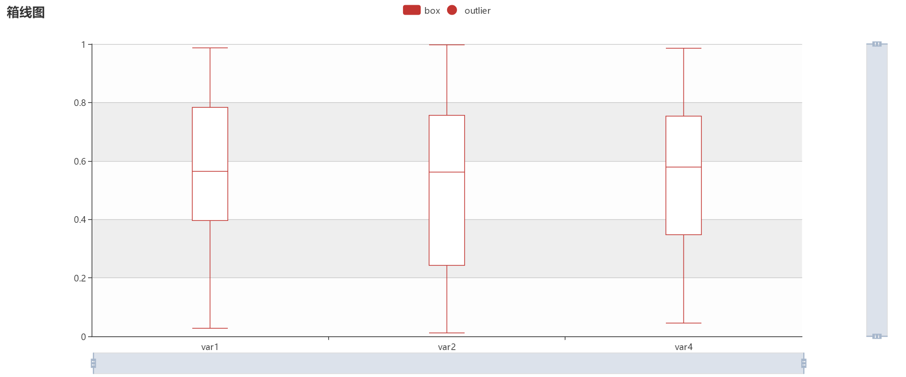

# MyEcharts
## 支持Jupyter notebook output 显示

    API 特性
    1.基于echarts 工具开发的定制化 分析模板，js采用离线加载方式，好处是加载速度相对较快
    2.支持Jupyter notebook 中output出在线网页，下面有示意图说明，功能函数中的参数 show  时表示是否显示output网页，默认显示

    API 目录架构
        /js
            /dataTool.js
            /dataTool.min.js
            /echarts.js
            /echarts.min.js
            /echarts.sankey.js
            /ecStat.js
            /jquery.js
        /templates
            /box.html
            /scatter.html
            /univariate.html
        MyEcharts.py

## 目前支持分析模板及对应函数 

    Plot_TBox :  绘制基于时间序列的箱线图 ，支持时间窗口包括 年，月，日，时，分，秒，周
    Example:

    from MyEcharts import Plot_TBox
    df = pd.DataFrame(np.random.rand(70,4),columns = ['var1','var2','var3','var4'])
    df['times'] = pd.date_range(start = '2018-01-02 00:00:00',freq = "1D",periods = len(df))
    Plot_TBox(df,'times','var1',kind = 'month')

    Plot_Univariate :  绘制多个变量和目标变量的散点图 ，支持在线切换变量
    Example:

    from MyEcharts import Plot_Univariate
    df = pd.DataFrame(np.random.rand(50,4),columns = ['var1','var2','var3','target'])
    df['class'] = ['A']*25+['B']*25
    Plot_Univariate(df,'target','class')

    Plot_Box :  绘制多变量的Box图
    Example:

    from MyEcharts import Plot_Box
    df = pd.DataFrame(np.random.rand(50,4),columns = ['var1','var2','var3','var4'])
    Plot_Box(df,['var1',"var2",'var4'],root = "html")

    Plot_Scatter :  绘制一对变量的散点图
    Example:

    from MyEcharts import Plot_Scatter
    df = pd.DataFrame(np.random.rand(50,4),columns = ['var1','var2','var3','target'])
    df['class'] = ['A']*25+['B']*25
    Plot_Scatter(df,'var1',"var2",label ='class')

    Plot_LineBar :  绘制多变量的Line图或Bar图，支持在线切换图类型
    Example:

    from MyEcharts import Plot_LineBar
    df = pd.DataFrame(np.random.rand(50,4),columns = ['var1','var2','var3','var4'])
    df.index= pd.date_range(start = '2018-01-01 00:00:00',freq = "1D",periods = len(df))
    Plot_LineBar(df,['var1',"var2",'var4'],kind =['line','bar','line'])

    Plot_Hist :  绘制多变量的hist分布图
    Example:

    from MyEcharts import Plot_Hist
    df = pd.DataFrame(np.random.rand(1000,4),columns = ['var1','var2','var3','var4'])
    df.index= pd.date_range(start = '2018-01-01 00:00:00',freq = "1D",periods = len(df))
    Plot_Hist(df,columns = ['var1','var4'],bins = {"var4":20},root = "html")

    Plot_Pie :  绘制多变量的Pie图,最多支持4个变量同时显示,支持自动布局
    Example:
    
    from MyEcharts import Plot_Pie
    df = pd.DataFrame([['A']]*25+[['B']]*35,columns = ['var1'])
    df['var2'] = ['a','b','c','d','e','f']*5+['h']*6+['i']*20+['j']*4
    df['var3'] = ['C']*25+['D']*30+['E']*5
    df['var4'] = ['X']*40+['Y']*20
    Plot_Pie(df,['var1','var4'],top=6,root = "html")

    Plot_3DScatter :  绘制空间三维散点图
    Example:
    
    from MyEcharts import Plot_3DScatter
    df = pd.DataFrame(np.random.rand(100,3),columns = ['var1','var2','var3'])
    df['class'] = ['A']*50+['B']*50
    Plot_3DScatter(df,'var1',"var2","var3",label ='class',root = "html")
    

    支持Jupyter notebook output显示原理：
    Jupyter notebook 中cell 类型设置为 MarkDown时 直接 引用iframe 标签 加载 外部 html时会有问题，导致页面显示不出来
    所以想要在 Jupyter notebook 引入外部界面，使用IPython.display 中的 HTML类 ,用HTML类来实例化 MarkDown 语言
    
    MyEcharts 这里显示的方式 是先生成离线html文件，引入iframe标签，用iframe导入html文件，再使用HTML类实例化html文本标记
    例如 : 

    from IPython.display import SVG,HTML
    example = '<iframe src="example.html" width="%s" height="%s" frameborder="0" scrolling="no"> </iframe>'
    HTML(example)

